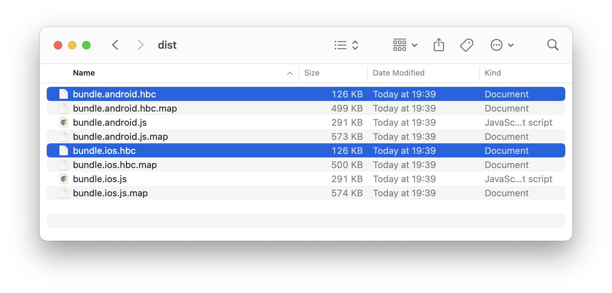

# Deploy Your Granite App

Get your app live on AWS in 5 minutes.

## What Happens When You Deploy

- Upload optimized bundles to your AWS S3 bucket
- Distribute globally via CloudFront CDN
- Update apps instantly
- Enable A/B testing with canary deployments

> **⏱️ Estimated time:** 5 minutes  
> **📱 Result:** Your app running live from AWS CDN

## Prerequisites

Make sure you've completed these guides first:

- **[Getting Started](./create-your-app.md)** - Your Granite app is built and working
- **[AWS Infrastructure](./setup-aws.md)** - Your AWS CDN is set up and running

## 1: Build Your Production App

First, let's build your [Granite app](./create-your-app.md) for production. Run this command in your project directory:

::: code-group

```sh [npm]
npm run build
```

```sh [pnpm]
pnpm run build
```

```sh [yarn]
yarn build
```

:::

Granite will create optimized microservice bundles, and your optimized bundles are now in the `dist/` directory:



> **✅ Success indicator:** You see built bundles, with sizes under 300KB each

## 2: Install Granite Forge CLI

Install the deployment tool to upload your bundles to AWS:

::: code-group

```sh [npm]
npm install @granite-js/forge-cli --save-dev
```

```sh [pnpm]
pnpm add @granite-js/forge-cli --save-dev
```

```sh [yarn]
yarn add @granite-js/forge-cli --dev
```

:::

## 3: Deploy Your App

With the S3 bucket set up from the [AWS infrastructure guide](./setup-aws.md), let's deploy your app.

Setup the AWS environment variables:

```bash
export AWS_ACCESS_KEY_ID="your-access-key-id"
export AWS_SECRET_ACCESS_KEY="your-secret-access-key"
export AWS_REGION="your-region"
```

::: code-group

```sh [npm]
npx granite-forge deploy --bucket {Your S3 Bucket Name}
```

```sh [pnpm]
pnpm granite-forge deploy --bucket {Your S3 Bucket Name}
```

```sh [yarn]
yarn granite-forge deploy --bucket {Your S3 Bucket Name}
```

:::

You'll see the deployment progress:

```
🚀 Starting deployment to AWS...

📋 Deployment Configuration:
├── Bucket: my-granite-app-bundles-2024
├── Region: us-east-1  
├── App: my-granite-app
└── Version: 100

📦 Uploading bundles...
├── ✅ index.bundle.js → s3://my-granite-app-bundles-2024/ios/my-granite-app/100/
├── ✅ profile.bundle.js → s3://my-granite-app-bundles-2024/ios/my-granite-app/100/
└── ✅ shared.bundle.js → s3://my-granite-app-bundles-2024/ios/my-granite-app/100/

📦 Uploading Android bundles...
├── ✅ index.bundle.js → s3://my-granite-app-bundles-2024/android/my-granite-app/100/
├── ✅ profile.bundle.js → s3://my-granite-app-bundles-2024/android/my-granite-app/100/
└── ✅ shared.bundle.js → s3://my-granite-app-bundles-2024/android/my-granite-app/100/

🌍 Your app is now live at:
├── iOS: https://d1234567890123.cloudfront.net/ios/my-granite-app/100/bundle
└── Android: https://d1234567890123.cloudfront.net/android/my-granite-app/100/bundle

🎉 Deployment completed successfully!
⏱️ Total time: 1m 23s
```

> **✅ Success indicator:** You see "Deployment completed successfully!" with your CDN URLs

## Step 5: Test Your Live App

### Update Your Test App

Configure your Granite test app to use the production bundles:

1. **Open Granite test app** on your simulator
2. **Go to Settings** → **Bundle Configuration**
3. **Set Bundle URL** to: `https://d1234567890123.cloudfront.net/ios/my-granite-app/100/bundle`
4. **Tap "Reload App"**

Your app should now load from AWS! 🌍

### Test on Real Device

To test on a real device:

1. **Install Granite test app** on your phone
2. **Scan QR code** or **enter URL manually**:
   ```
   https://d1234567890123.cloudfront.net/ios/my-granite-app/100/bundle
   ```
3. **Your app loads instantly** from the CDN

> **✅ Success indicator:** Your app loads and works exactly like in development

## Understanding Deployment URLs

Your app is deployed to specific URLs based on platform and version:

### URL Structure
```
https://<your-cdn>/[platform]/[appName]/[version]/bundle
```

### Example URLs
```bash
# iOS bundles
https://d1234567890123.cloudfront.net/ios/my-granite-app/100/bundle

# Android bundles  
https://d1234567890123.cloudfront.net/android/my-granite-app/100/bundle
```

### Version Numbers (1-1000)
- **1-100**: Canary releases (limited users)
- **101-500**: Beta releases  
- **501-1000**: Production releases

## Advanced Deployment Options

### Deploy Specific Version

Deploy to a specific version number:

```bash
npx granite-forge deploy --version 250
```

### Deploy to Different Environment

Deploy to staging or production:

```bash
# Deploy to staging
npx granite-forge deploy --env staging

# Deploy to production  
npx granite-forge deploy --env production
```

### Canary Deployment

Deploy to a small percentage of users first:

```bash
# Deploy to 10% of users
npx granite-forge deploy --canary 10

# If successful, promote to all users
npx granite-forge promote --version 100
```

## Managing Your Deployments

### View Deployment History

See all your previous deployments:

```bash
npx granite-forge list
```

### Rollback to Previous Version

If something goes wrong, rollback instantly:

```bash
# Rollback to previous version
npx granite-forge rollback

# Or rollback to specific version
npx granite-forge rollback --version 95
```

### Delete Old Versions

Clean up old bundles to save storage costs:

```bash
# Keep only last 10 versions
npx granite-forge cleanup --keep 10
```

## 🎉 Congratulations!

Your Granite app is now live on AWS! Here's what you can do now:

- ✅ **Update instantly** - Deploy new versions without app store approval
- ✅ **Global performance** - Your app loads fast worldwide via CDN
- ✅ **A/B testing** - Test features with different user groups
- ✅ **Instant rollbacks** - Fix issues immediately if needed

## What's Next?

Now that your app is deployed:

1. **[Set Up CI/CD](./cicd-setup.md)** - Automate deployments from Git
2. **[Configure A/B Testing](./ab-testing.md)** - Test features safely
3. **[Monitor Performance](./monitoring.md)** - Track your app's health
4. **[Integrate with Existing Apps](./brownfield-integration.md)** - Add to current apps

## Troubleshooting

**"Bucket not found" error:**
- Make sure your bucket name in config matches AWS setup
- Check that your AWS credentials are still valid

**Bundles not loading in app:**
- Verify the CDN URL is correct
- Wait 5-10 minutes for CloudFront to update
- Check browser developer tools for error messages

**Deployment takes too long:**
- Large bundles take more time to upload
- Check your internet connection
- Consider optimizing bundle sizes

**App crashes after deployment:**
- Test locally first with `npm run dev`
- Check bundle compatibility between development and production
- Review error logs in your test app

## Need Help?

- 📖 [Deployment Troubleshooting](../troubleshooting/deployment.md)
- 💬 [Discord Community](https://discord.gg/granite) - Get help from other developers
- 🐛 [GitHub Issues](https://github.com/your-org/granite/issues) - Report deployment issues

---

**Next:** [Set Up CI/CD Pipeline →](./cicd-setup.md)

# Deploy Your App

This guide explains how to create a Granite application using `granite-app` and deploy service bundles to AWS using the `granite-forge` deployment tool. By following this process, you can deploy and run your application on an Amazon S3 bucket.

## Prerequisites

To deploy your application to AWS, you need to meet the following conditions:

- **Your Granite app** - Complete the [Getting Started guide](./create-your-app.md) first
- **AWS infrastructure** - Complete the [AWS infrastructure guide](./setup-aws.md) first

## 1. Building the Application

Build the optimized Granite app created in the [getting Started guide](./create-your-app.md#7-build-your-app) with the following command:

::: code-group

```sh [npm]
npm run granite build
```

```sh [pnpm]
pnpm granite build
```

```sh [yarn]
yarn granite build
```

:::

## 2. Install the Granite Forge CLI


### Installing Dependencies

Install the `granite-forge` CLI to deploy Granite applications.

::: code-group

```sh [npm]
npm install @granite-js/forge-cli --save-dev
```

```sh [pnpm]
pnpm add @granite-js/forge-cli --save-dev
```

```sh [yarn]
yarn add @granite-js/forge-cli --dev
```

:::


## 3. Deploying the Service Bundle

This command uploads the built service bundle to the specified S3 bucket and provisions the necessary AWS resources to deploy the application. You must specify the correct S3 bucket name for deployment using the `--bucket` option.

::: code-group

```sh [npm]
npm run granite-forge deploy --bucket {Your S3 Bucket Name}
```

```sh [pnpm]
pnpm granite-forge deploy --bucket {Your S3 Bucket Name}
```

```sh [yarn]
yarn granite-forge deploy --bucket {Your S3 Bucket Name}
```

:::

## Next Steps

Once the application is successfully deployed, you can use the following endpoint addresses to access the service on each platform.
`1-1000` should be replaced with a number between `1` and `1000`. This number is used for canary deployments.

The endpoint addresses are as follows:
- iOS: `https://<cloudfront-cdn>/ios/<appName>/1-1000/bundle`
- Android: `https://<cloudfront-cdn>/android/<appName>/1-1000/bundle`
