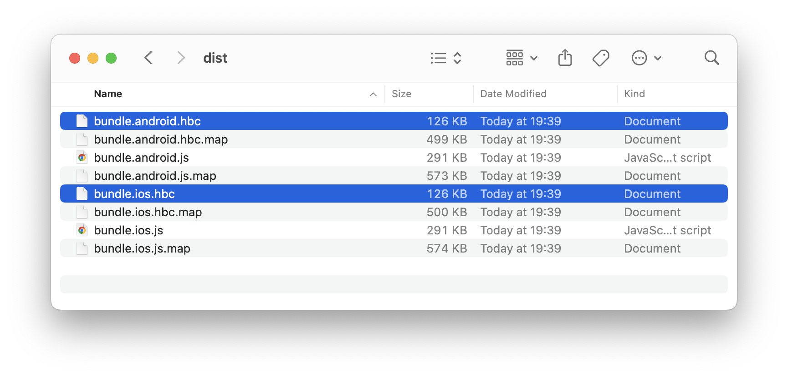
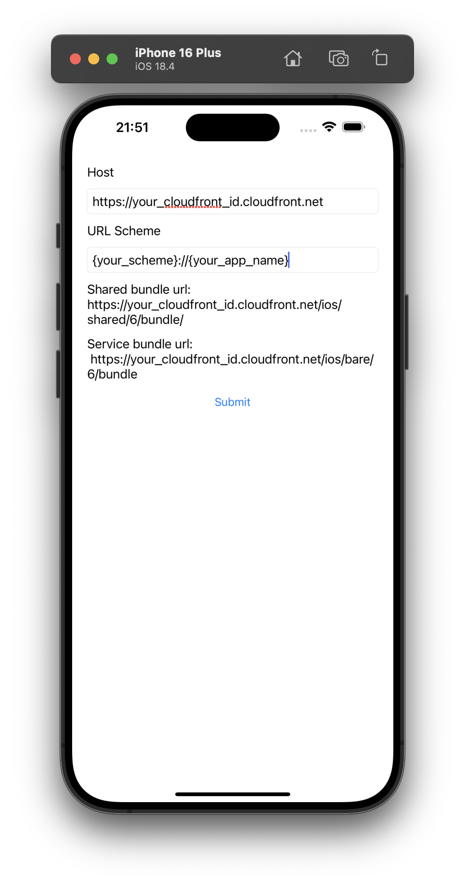

# Granite 앱 배포하고 실행하기

5분 안에 AWS에 Granite 앱을 배포해보세요.

## 배포할 때 일어나는 일

- 최적화된 번들을 AWS S3 버킷에 업로드
- CloudFront CDN을 통해 전 세계에 배포
- Granite앱을 즉시 업데이트

> **⏱️ 예상 소요 시간:** 5분

> **📱 결과:** AWS CDN에서 실행되는 앱

## 준비물

다음 가이드를 먼저 완료했는지 확인하세요.

- **[시작하기](./create-your-app)** - Granite 앱이 빌드되고 작동하는 상태
- **[AWS 인프라 설정하기](./setup-aws)** - AWS CDN이 설정되고 실행 중인 상태

## 1. 프로덕션용 앱 빌드하기

먼저 프로덕션용 [Granite 앱](./create-your-app)을 빌드해보세요. 프로젝트 디렉토리에서 다음 명령어를 실행하세요.

::: code-group

```sh [npm]
npm run build
```

```sh [pnpm]
pnpm run build
```

```sh [yarn]
yarn build
```

:::

Granite가 최적화된 JavaScript 번들을 만들어요. 최적화된 번들은 `dist/` 디렉토리에 있어요.



> **✅ 성공했다면:** 각각 300KB 미만인 빌드된 번들이 보여요

## 2. Granite Forge CLI 설치하기

번들을 AWS에 업로드하기 위한 배포 도구인 Forge CLI를 설치하세요.

::: code-group

```sh [npm]
npm install @granite-js/forge-cli --save-dev
```

```sh [pnpm]
pnpm add @granite-js/forge-cli --save-dev
```

```sh [yarn]
yarn add @granite-js/forge-cli --dev
```

:::

## 3. 앱 배포하기

[AWS 인프라 가이드](./setup-aws)에서 설정한 S3 버킷을 사용해 앱을 배포해보세요.

::: code-group

```sh [npm]
npx granite-forge deploy --bucket {S3 버킷 이름}
```

```sh [pnpm]
pnpm granite-forge deploy --bucket {S3 버킷 이름}
```

```sh [yarn]
yarn granite-forge deploy --bucket {S3 버킷 이름}
```

:::

배포 진행 상황이 보여요.

```
$ npx granite-forge deploy --bucket {버킷 이름}
┌  Start deployment
│
◇  Successfully fetched current deployment state
│
▲  No deployment state found
│
◇  Are you sure you want to deploy test-granite-app?
│  Yes
│
◇  Bundle uploaded
│
◇  Bundle list updated
│
◇  Deployed successfully! (Deployment ID: **********************)
│
└  Done
```

> **✅ 성공했다면:** "Done" 메시지가 보여요

## 4. Granite 앱 테스트

이제 앱이 배포됐으니 Granite 테스트 앱으로 테스트해보세요.

시뮬레이터에서 [Granite 테스트 앱](../miscellaneous/install-native-app)을 열고 다음 정보를 입력하세요.

| 필드       | 입력할 내용                                                                                                                             |
| ---------- | --------------------------------------------------------------------------------------------------------------------------------------- |
| Host       | [AWS 인프라 배포](../quick-start/setup-aws.html#_7-인프라-배포하기)에서 얻은 CDN URL (인프라 배포 후 출력에서 확인할 수 있어요) |
| URL Scheme | `{your-scheme}://{your-app-name}` 형식의 앱 URL 스킴 (이 값들은 Granite 설정에서 가져와요)                                              |

::: details 스킴과 앱 이름 찾기

이 값들은 'granite.config.ts' 파일에 정의되어 있어요. 다음과 같이 찾을 수 있어요.

```ts
import { defineConfig } from '@granite-js/react-native/config';

export default defineConfig({
  // 예시 실행 스킴: granite://showcase
  scheme: 'granite',
  appName: 'showcase',
  plugins: [
    // ...
  ],
});
```

:::



제출을 누르면 AWS 인프라에서 앱이 즉시 로딩돼요! 이제 앱이 전 세계 CDN을 통해 서비스되고 있어요. 🌍

## 예시 영상

| iOS                                                                                                                                                                                                            | Android                                                                                                                                                                                                            |
| -------------------------------------------------------------------------------------------------------------------------------------------------------------------------------------------------------------- | ------------------------------------------------------------------------------------------------------------------------------------------------------------------------------------------------------------------ |
| <video autoplay loop muted style="max-width:400px; width:100%; height:auto; margin-top:1rem;"> <source src="/videos/ios_showcase.mp4" type="video/mp4" /> 브라우저가 비디오 태그를 지원하지 않습니다. </video> | <video autoplay loop muted style="max-width:400px; width:100%; height:auto; margin-top:1rem;"> <source src="/videos/android_showcase.mov" type="video/mp4" /> 브라우저가 비디오 태그를 지원하지 않습니다. </video> |

## 배포 URL 이해하기

앱은 플랫폼과 버전에 따라 특정 URL에 배포돼요.

### URL 구조

```
https://<your-cdn>/[platform]/[appName]/[version]/bundle
```

### URL 예시

```bash
# iOS 번들
https://d1234567890123.cloudfront.net/ios/my-granite-app/100/bundle

# Android 번들
https://d1234567890123.cloudfront.net/android/my-granite-app/100/bundle
```

### 버전 번호 (1-1000)

버전 번호는 앱 업데이트를 받는 사용자의 비율을 0%에서 100%까지 0.1% 단위로 제어해요.

## 🎉 축하해요!

이제 Granite 앱이 AWS에서 실행되고 있어요! 이제 다음과 같은 것들을 할 수 있어요.

- **즉시 업데이트** - CLI 명령어 하나로 새 버전 배포
- **전 세계에 배포** - CDN을 통해 전 세계에서 앱 로딩
